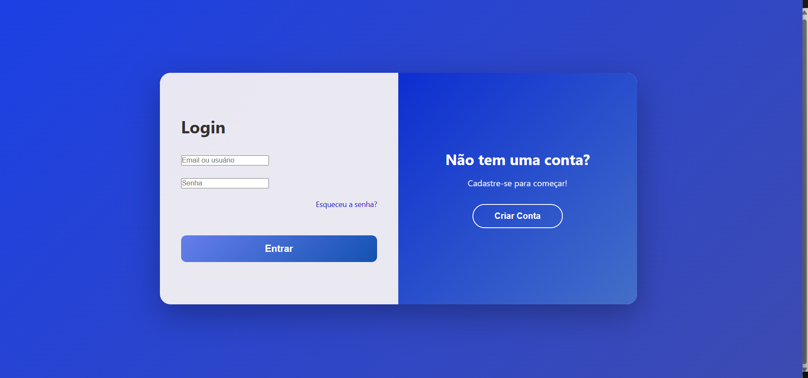
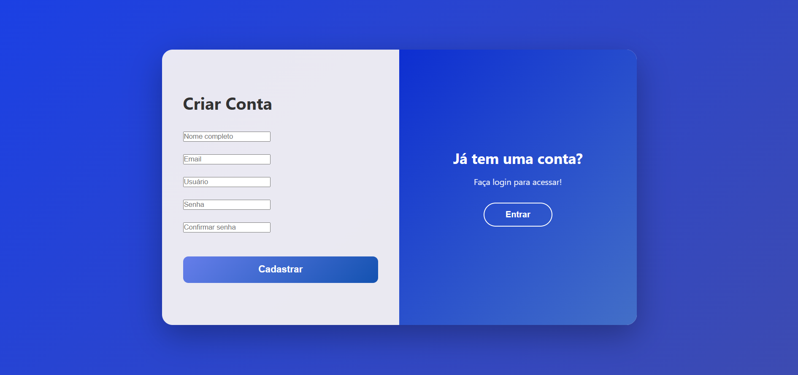

# Página de Login | HTML + CSS + JavaScript

Este é o meu primeiro projeto prático utilizando **HTML, CSS e JavaScript**.  
Desenvolvi uma interface moderna de **Login e Cadastro**, com transição entre as telas e layout totalmente responsivo.

## Funcionalidades

- 🟦 Tela de **Login**
- 🟩 Tela de **Cadastro**
- 🔁 Alternância entre Login ↔ Cadastro com JavaScript
- 📱 Layout responsivo (desktop, tablet e mobile)

## Tecnologias Utilizadas

- HTML5
- CSS3
- JavaScript

## 📸 Preview do Projeto

  
  

